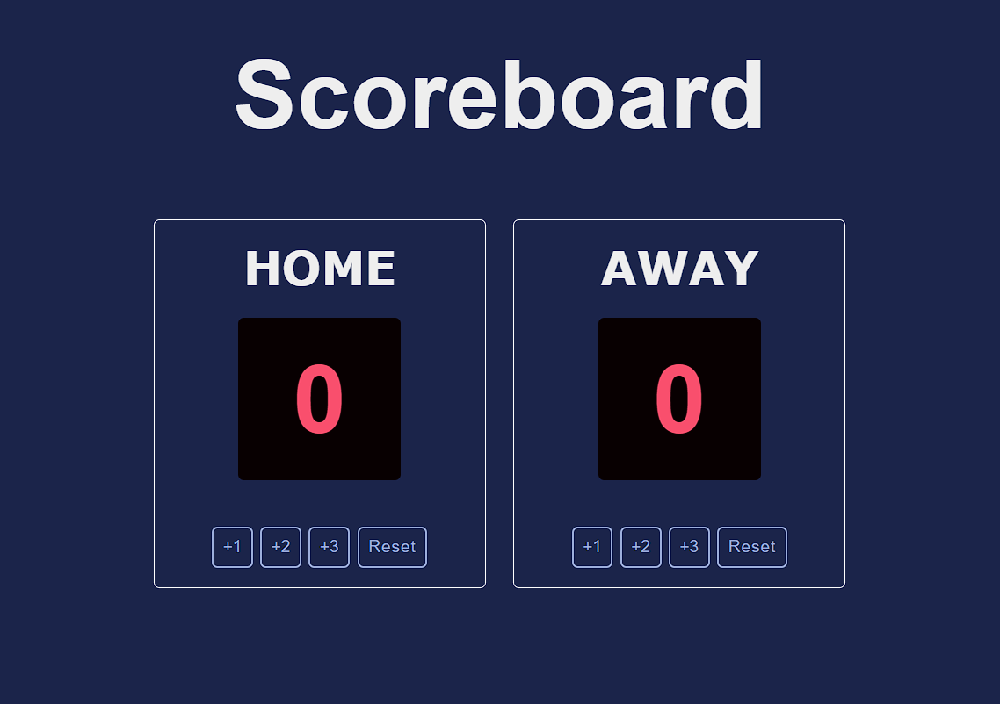

# JavaScript Basketball Scoreboard



## Description

This is a JavaScript-based Basketball Scoreboard application designed for tracking and displaying real-time scores during basketball games. The project is developed using HTML, CSS, and JavaScript.

## Demo

See the scoreboard in action here: [Demo](https://abiek12.github.io/Basketball-Scoreboard/)

## Installation

To run this project locally:

1. Clone the repository:

   ```bash
   git clone https://github.com/abiek12/Basketball-Scoreboard.git
   ```

2. Open the `index.html` file in your web browser.

## Technologies Used

- HTML
- CSS
- JavaScript

## Acknowledgments

Special thanks to [Scrimba](https://www.scrimba.com/) for their valuable educational resources and inspiration.

## Contact

- Abhishek p p
- GitHub: [abiek12](https://github.com/abiek12)
- Email: abhishekkanichery@gmail.com
